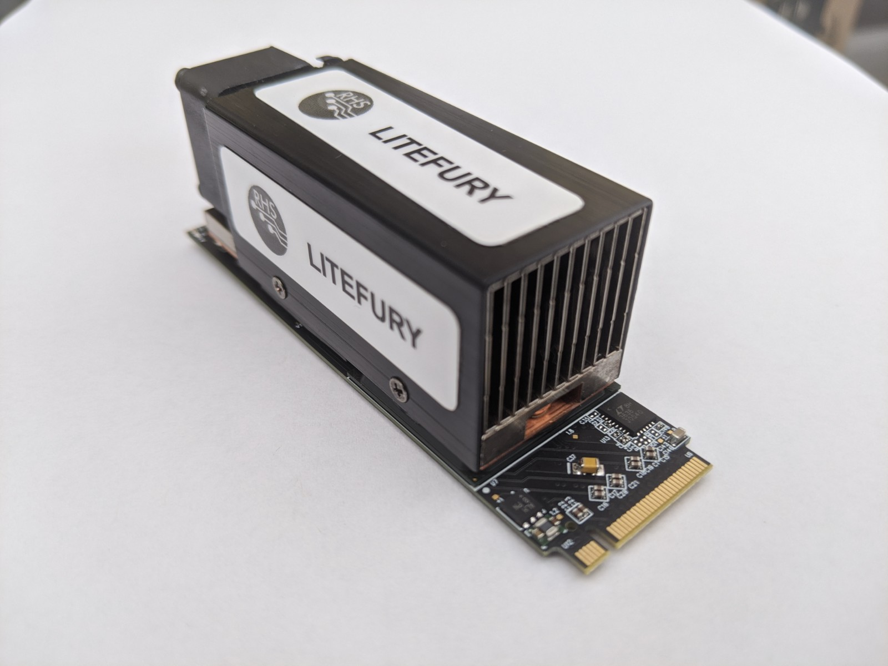
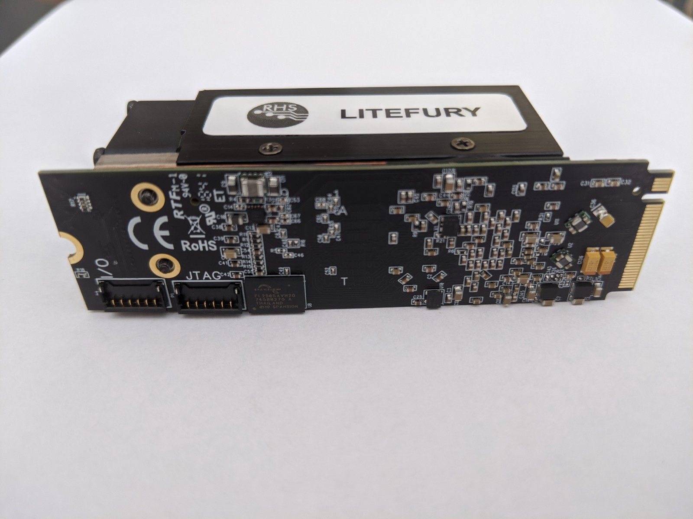
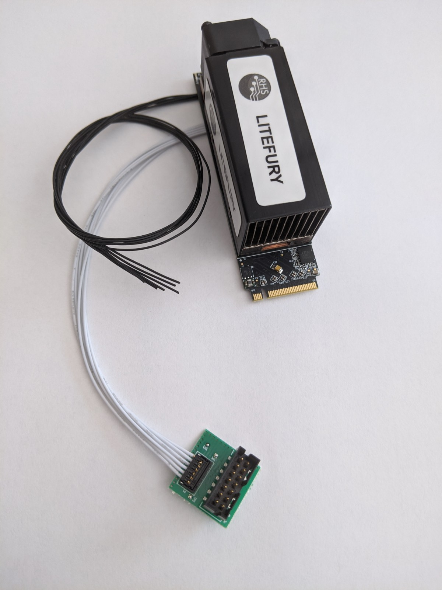

# NiteFury and Litefury: Xilinx FPGA development board kit in M.2 form factor

Ever wanted to work with FPGA, and connect to DDR and PCI express without spending a small fortune?

NiteFury and Litefury are compact, full-featured FPGA developement boards featuring a decent size FGPA, DDR3, and PCI express connectivity in a small form factor, for a low price.

## Features and general specifications
- Xilinx FPGA
- Onboard DDR3 with 1.6GB/s bandwidth
- Onboard configuration flash (S25FL series)
- PCIe x4 gen 2 interface to FGPA (2GB/s)
- IO: 4x LVDS pairs and 4 general purpose
- 4 user controlled LEDs
- External I/O via I/O connector: 12 Total, 4 selectable analog or digital
- External I/O via PCIe connector: 1x 3.3V digital I/O (LED), SMBus
- 10W VCCINT supply
- Dimensions: 22x80x28mm

## Specifications
| Feature | Nitefury-II | Litefury |
| --- | --- | --- |
| FPGA | XC7A200T-2FBG484E | XC7A100T-L2FGG484E |
| RAM | 1GB DDR3-800 | 512MB DDR3-800 |
| Flash | 256Mb | 128Mb, 256Mb |

## Block Diagram

## Litefury

## Where to buy

- [RHS Research store](https://rhsresearch.com)
- [Amazon](https://www.amazon.com/dp/B08BKSVJH5)

## More information

info@nanoevb.com
