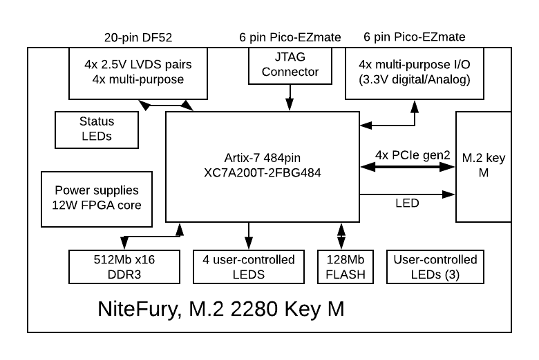
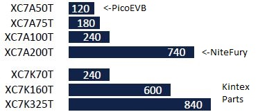
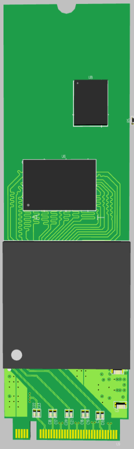
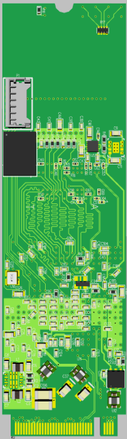
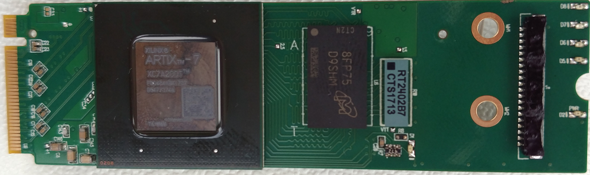
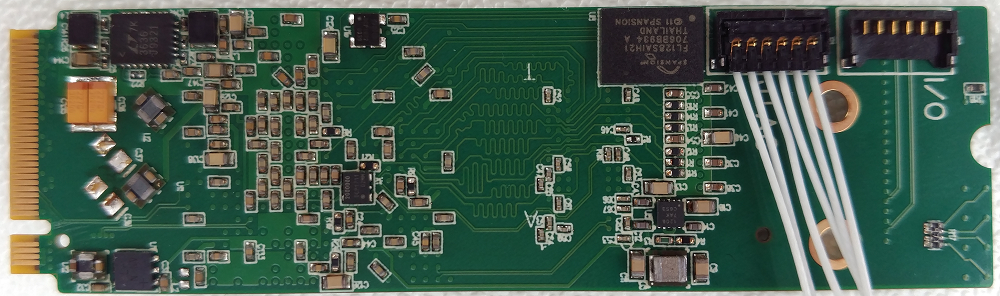

# NiteFury: FPGA-based coprocessor in M.2 format

NiteFury is Xilinx Artix A200 FPGA & DDR3 in a small form factor (M.2 2280 M key).

## Features
- Xilinx A200T FPGA: Just under 1000 GMAC/s
- 8Gb DDR3 on board. DDR3-800 x16 (1.6GB/s)
- PCIe x4 gen 2 interface to FGPA (2GB/s)
- IO: 4x LVDS pairs and 4 general purpose

## Specifications

| Feature | Specification |
| --- | --- |
| FPGA | Xilinx Artix XC7A200T-2FBG484E |
| RAM | DDR3, 8Gb (512MBx16) |
| Form Factor | M.2 (NGFF), keyed for M slot |
| Dimensions | 22x80x4.7mm (without heatsink) |
| Host Interface | PCIe x4 gen 2 (20 Gb/s) |
| Host Tools | Vivado  |
| Built-in JTAG | No |
| External I/O   via I/O connector | 12 Total, 4 selectable analog or digital  |
| External I/O via PCIe connector | 1x 3.3V digital I/O (LED), SMBus |
| User-controllable LEDs | 4 |

## Block Diagram

## DSP Processing metrics (DSP slices)

NiteFury has 6x the processing power of PicoEVB, and is comparable with midrange Kintex devices

## Rendering

## Prototype pics

## Verified configurations
- XC7A200T-2 with 4Gb DDR3-800

## How to get one

- [Crowd Supply](https://www.crowdsupply.com/rhs-research/nitefury)

## More information

info@nanoevb.com

