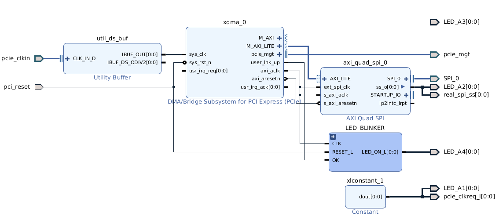
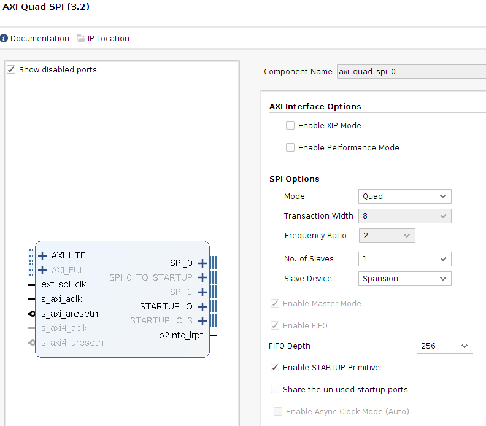
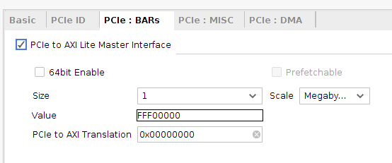

# spi-loader

Flash programming over PCIe using AXI SPI block

## Limitations
- Linux-only standalone executable
- Only works with S25FL parts
- Assumes 64KB sector size- could erase faster on S25FLxxxxxx1x which have 256KB sectors
- Partial sector programming is not supported. Entire sectors are erased, enough to fit the amount of data being programmed,
   then the data is programmed. If the data doesn't exactly fill a sector on either end, the erased data will not be restored.
- Sector protection/unprotection unsupported
- Tested on Ubuntu 18.04 only


## Performance

Expect about 100MB/s total programming speed (this includes the erase). The SPI flash is clocked at 50MHz.

## Usage
```
spi-loader V1.2 copyright 2019 RHS Research LLC
Usage: spi-loader [-a flashaddr] [-b fileoffset] [-l len] [-d device] [-r deviceoffset] [-f binary file] [-m mcs file]
 Loads len bytes from file at fileoffset into flash at address flashaddr

 Programming specification options
   -a: Address of first byte in flash to overwrite
   -b: Byte index into file to start reading (default to 0)
   -l: Number of bytes to write (default of 0 means write all bytes in file)
   -f: Data file to load (raw binary)
   -m: Data file to load (MCS)
 AXI-SPI core access configuration options
   -d: Device filename where SPI core can be accessed
   -r: Address (offset) of AXI-SPI core in device file
 Other options
   -v: Verify after programming
 Note: Numeric values default to decimal, unless prefixed with 0x
```

## Supporting FPGA project block diagram


Constraints:
```
###############################################################################
# SPI
###############################################################################
set_property PACKAGE_PIN P22 [get_ports {SPI_0_io0_io}]
set_property PACKAGE_PIN R22 [get_ports {SPI_0_io1_io}]
set_property PACKAGE_PIN P21 [get_ports {SPI_0_io2_io}]
set_property PACKAGE_PIN R21 [get_ports {SPI_0_io3_io}]

set_property IOSTANDARD LVCMOS33 [get_ports {SPI_0_io0_io}]
set_property IOSTANDARD LVCMOS33 [get_ports {SPI_0_io1_io}]
set_property IOSTANDARD LVCMOS33 [get_ports {SPI_0_io2_io}]
set_property IOSTANDARD LVCMOS33 [get_ports {SPI_0_io3_io}]

set_property PACKAGE_PIN T19 [get_ports {real_spi_ss}]
set_property IOSTANDARD LVCMOS33 [get_ports {real_spi_ss}]

set_property PACKAGE_PIN U21 [get_ports {SPI_0_ss_t}]
set_property IOSTANDARD LVCMOS33 [get_ports {SPI_0_ss_t}]
```

## Required SPI block configuration


To get AXI-Lite interface from PCIe block:



## Dependencies

C++11 compiler and cmake. 

